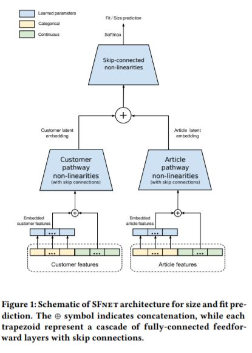

# fit-recommendation
Deep Learning based solution for fit clothing size recommendation

Basically the idea is can we create a recommender system for the customers based on the product such that we can reduce bad customer experience due to products not fitting on purchase, this can be wildly attributed to variation of sizes across brand and their reporting standards, the exact product size is not shipped (assuming to be rare) etc.

Now, the recommendation like in any generic case is a function of the person and the items he/she likes and so will be the case here.Our dataset is of the form customer, product -> feedback .

Features for customers could capture their preferences of what type of fitting they like (some like large fitting, some like slim fit etc.) Features for products could capture style, type and size specific properties.

There are couple of papers that worked on solving this problem

- A Deep Learning System for Predicting Size and Fit in Fashion E-Commerce (https://arxiv.org/pdf/1907.09844.pdf)
- https://www.groundai.com/project/analyzing-customer-feedback-for-product-fit-prediction/1
- https://deepai.org/publication/a-hierarchical-bayesian-model-for-size-recommendation-in-fashion
- https://www.youtube.com/watch?v=KWTHkqxrlmQ (Product Size Recommendation for Fashion E-commerce)
- https://www.youtube.com/watch?v=OS9bXqeLhMA (Decomposing Fit Semantics)

The code I am sharing is for the latest paper in the series where author has described a SFNet architecture. Attached is an image shared in the paper.

## Data
I am using modcloth data to build the recommender system , and without loss of brevity the same code can be used for renttherunway dataset with minor changes.
Data can be found from https://www.kaggle.com/rmisra/clothing-fit-dataset-for-size-recommendation.

Credits to Rishab Misra for the data.

## Solution Design
- Do data munging and feature normalization on the modcloth dataset.
- Use of TF2.0 Feature layers to convert modlcoth columns into features for our NN model.
- Create Customer/Article pathway non-linearities with skip connection as a class.
- Create the SFNet Architecture
- Experiments with Text data using pre-trained models liker Bert/Elmo etc.
